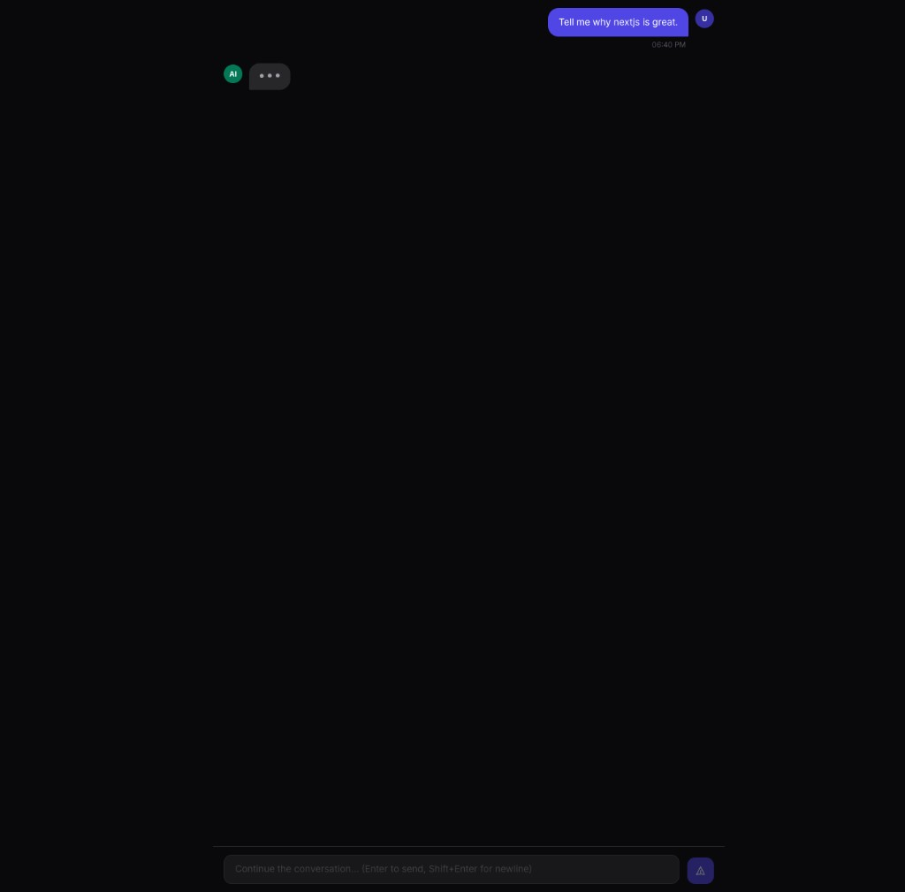
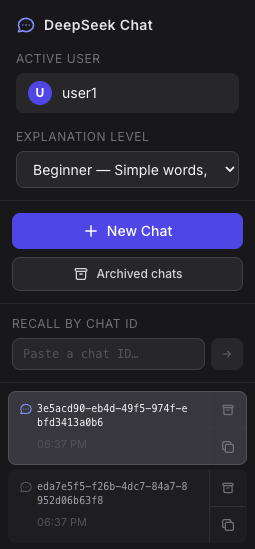
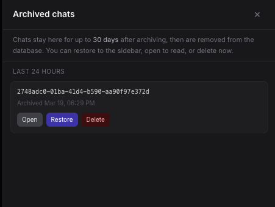
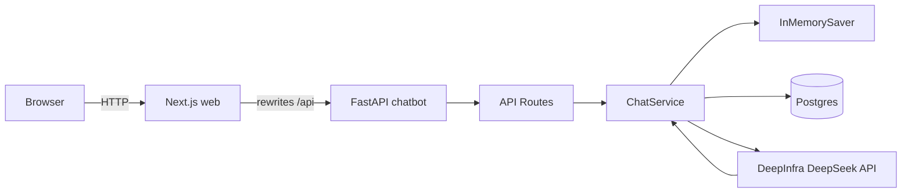

# DeepSeek FastAPI Chatbot

## Web UI screenshots

The **Next.js** frontend: main chat (with streaming / “thinking” state), sidebar controls, and the archived-chats drawer.

| Main chat | Sidebar |
| --- | --- |
|  |  |

**Archived chats** — retention copy, time buckets (e.g. *Last 24 hours*), and per-chat **Open** / **Restore** / **Delete**:



---

This repository contains a simple chatbot backend built with FastAPI and backed by DeepSeek through DeepInfra's OpenAI-compatible chat completions API. The chatbot keeps active conversation state in LangGraph's `InMemorySaver`, persists users/chats/messages in Postgres, and can be run locally or with Docker Compose.

DeepSeek integration is implemented against DeepInfra's documented chat completions endpoint:
[DeepSeek-V3.2 API Reference](https://deepinfra.com/deepseek-ai/DeepSeek-V3.2/api?example=http)

## Overview

The backend supports:

- creating or resuming a chat for a `userId`
- sending messages to DeepSeek using a stable `chatId`
- recalling stored chat history from Postgres
- preserving active in-process conversational context with `InMemorySaver`
- running the API in Docker alongside Postgres
- running a **Next.js** `web` UI that proxies API calls to the backend (`/api/*` → FastAPI, with a **dedicated Route Handler** for chat messages so **SSE streams** are not buffered)

The project currently uses a single identifier for conversation state:

- `chatId` is the persistent chat identifier in Postgres
- the same `chatId` is used as the LangGraph `thread_id` for `InMemorySaver`

## Project Structure

```text
.
├── docs/readme/                # README screenshots
├── alembic/                    # DB migrations (Postgres)
├── alembic.ini
├── chatbot/
│   ├── api/
│   │   ├── routes.py
│   │   └── schemas.py
│   ├── services/
│   │   ├── chat_service.py
│   │   └── deepseek_client.py
│   ├── config.py
│   ├── db.py
│   └── main.py
├── web/                         # Next.js frontend (Docker + local dev)
│   ├── app/
│   ├── components/
│   ├── lib/
│   ├── next.config.ts
│   └── Dockerfile
├── tests/
│   ├── test_api_routes.py
│   ├── test_assistant_blocks.py
│   └── test_chat_service.py
├── docker-compose.yml
├── Dockerfile                   # Python chatbot API image
└── requirements.txt
```

## Architecture




With Docker Compose, the browser hits `http://localhost:3000`; Next.js proxies most `/api/...` paths to `http://chatbot:8000/...` via **rewrites**. **`POST/GET /api/chats/{id}/messages`** is handled by **`web/app/api/chats/[chatId]/messages/route.ts`**, which forwards the backend response body **without buffering** so long **DeepSeek SSE** replies work reliably. Direct API access is still `http://localhost:8000`.

### Request Flow

1. A client starts or resumes a chat with a `userId` and optional `chatId`.
2. The backend creates or looks up the `User` and `Chat` records in Postgres.
3. When a message is sent, `ChatService` loads stored messages for the chat if in-memory state is empty.
4. The service builds an OpenAI-style `messages` payload and calls DeepSeek through DeepInfra (non-streaming JSON or **streaming** SSE from the upstream API).
5. The user message is persisted first; the assistant message is saved after the full reply is known (streaming accumulates tokens server-side).
6. The in-memory thread for that `chatId` is updated so subsequent turns have context without reloading everything each time.

## Components

### `chatbot/main.py`

Application entrypoint. It:

- loads environment settings
- runs **Alembic** `upgrade head` once at startup (via `asyncio.to_thread` so the event loop stays free)
- creates the **async** SQLAlchemy engine and session factory
- creates the shared async `DeepSeekClient`
- creates the shared `ChatService`
- attaches those resources to `app.state`

### `chatbot/config.py`

Environment-backed application settings via `pydantic-settings`.

`database_url` (sync, **Alembic**) and **`database_url_async`** (**FastAPI** + `psycopg_async`) are derived from the same `POSTGRES_*` variables.

Important settings:

- `DEEPINFRA_TOKEN`
- `DEEPINFRA_BASE_URL`
- `DEEPSEEK_MODEL`
- `REQUEST_TIMEOUT_SECONDS` (default **600** — suitable for slow or streamed completions)
- `POSTGRES_USER`
- `POSTGRES_PASSWORD`
- `POSTGRES_DB`
- `POSTGRES_HOST`
- `POSTGRES_PORT`
- `APP_HOST`
- `APP_PORT`

### `chatbot/db.py`

Single database module that contains:

- SQLAlchemy `Base`
- `User`, `Chat`, and `Message` models
- `utcnow()` helper
- **`create_async_db_engine()`** / **`create_async_session_factory()`** for the FastAPI app (`postgresql+psycopg_async://...`)

Alembic uses the sync URL from **`Settings.database_url`** (`postgresql+psycopg://...`) in `alembic/env.py`.

Data model summary:

- `users`
  - `user_id`
  - `latest_chat_id`
  - timestamps
- `chats`
  - `chat_id`
  - `user_id`
  - timestamps
- `messages`
  - `id`
  - `chat_id`
  - `role`
  - `content`
  - timestamp

### `chatbot/services/deepseek_client.py`

Async **httpx** client for DeepInfra's OpenAI-compatible endpoint:

- `POST /openai/chat/completions` (full response)
- same path with `stream: true` → **`stream_chat_completion`** parses **SSE** (`data:` lines / `[DONE]`)

It sends:

- `Authorization: Bearer <DEEPINFRA_TOKEN>`
- `Content-Type: application/json`
- `model: deepseek-ai/DeepSeek-V3.2` by default
- `messages: [...]`

### `chatbot/services/chat_service.py`

Core orchestration layer responsible for:

- starting or resuming chats
- enforcing chat ownership
- listing chats per user
- returning persisted history
- rehydrating memory from stored messages
- calling DeepSeek
- storing each user/assistant turn

`InMemorySaver` is used through a minimal LangGraph state graph, with `chatId` passed as the `thread_id`.

### `chatbot/api/routes.py`

Defines the HTTP API and translates service exceptions into HTTP responses:

- `403` for ownership violations
- `404` for missing chats
- `502` for DeepSeek upstream failures

### Web frontend (`web/`)

- **Next.js 15** app with `output: "standalone"` for Docker.
- `**next.config.ts`** rewrites `GET/POST /api/:path*` to `${BACKEND_URL}/:path*` for most routes.
- **`app/api/chats/[chatId]/messages/route.ts`** handles **`GET/POST`** for chat messages and **`fetch`es the FastAPI response with `res.body` piped through**, avoiding rewrite buffering for **SSE** (`text/event-stream`) when `stream: true`.
- `**experimental.proxyTimeout**` (default **300000** ms via `BACKEND_PROXY_TIMEOUT_MS`) still helps other proxied API calls (e.g. long non-streaming requests).
- **Docker:** `BACKEND_URL` must be set at **image build time** and **runtime** for Route Handlers. Compose passes `BACKEND_URL: http://chatbot:${APP_PORT:-8000}`.
- **Local dev** (`npm run dev` in `web/`): run the API on the host and use `BACKEND_URL=http://127.0.0.1:8000` if needed.
- **Explanation level:** the sidebar dropdown sets beginner / moderate / expert; the app sends `explanation_level` on each message.
- **Streaming:** the chat UI uses **`streamAssistantMessage`** (`stream: true`) and appends assistant text as chunks arrive; the final `done` event replaces the bubble with the normalized server message (same JSON block format as non-streaming).

### Logging

- **Chatbot:** Uvicorn writes access and startup logs to **stdout/stderr**, which Docker captures as `docker compose logs chatbot`.
- **Web:** Next.js server logs (including occasional `Failed to proxy` if a client disconnects during a long DeepSeek request) appear in `docker compose logs web`.

## API Endpoints

### Explanation levels

The model is instructed to answer **only** with a single JSON object (no Markdown): `{"blocks":[...]}` where each block is a `heading`, `paragraph`, `list`, `code`, or `table`. The API **normalizes** every assistant turn to that shape (invalid JSON is wrapped as one `paragraph` block). The **web UI** parses `message.content` and renders headings, lists, code, and tables with proper styling. On top of tone and structure, you choose how deep the explanation goes:


| Value      | Audience        | Behavior                                                                                      |
| ---------- | --------------- | --------------------------------------------------------------------------------------------- |
| `beginner` | ~5th grade      | Very simple words, short sentences, analogies; avoid jargon unless defined in plain language. |
| `moderate` | Junior engineer | Assumes basic coding literacy; defines specialized terms once; concrete examples.             |
| `expert`   | Senior engineer | Concise, precise; assumes common patterns and tradeoffs; focuses on nuance and implications.  |


- **API:** send `explanation_level` on `POST /chats/{chat_id}/messages` (default: `moderate`).
- **Web UI:** use the **Explanation level** control in the sidebar; the choice is stored in `localStorage` and sent with each message.

Optional `system_prompt` on the same request is **appended** to this built-in prompt (for extra one-off instructions).

### Health

`GET /health`

Response:

```json
{
  "status": "ok"
}
```

### Start Or Resume Chat

`POST /chats/start`

Request body:

```json
{
  "user_id": "user-123",
  "chat_id": "chat-abc"
}
```

`chat_id` is optional. If omitted, the service creates a new UUID-based chat.

Response:

```json
{
  "user_id": "user-123",
  "chat_id": "chat-abc",
  "created": true
}
```

### Send Message

`POST /chats/{chat_id}/messages`

Request body:

```json
{
  "user_id": "user-123",
  "content": "Hello there",
  "explanation_level": "moderate",
  "system_prompt": "Be concise",
  "stream": false
}
```

`explanation_level` is optional and defaults to `moderate`. Allowed values: `beginner`, `moderate`, `expert`.

`system_prompt` is optional; when set, it is appended to the server’s built-in system prompt.

Optional **`stream`** (default `false`):

- `false`: JSON response as below.
- `true`: response **`Content-Type: text/event-stream`**. Each event is one SSE line:

```text
data: {"type":"chunk","text":"..."}

data: {"type":"done","user_id":"...","chat_id":"...","message":{"role":"assistant","content":"...","created_at":"..."}}

```

If something fails after the stream has started, the server may emit `{"type":"error","detail":"..."}` inside the SSE stream (HTTP status may remain 200).

JSON response (non-streaming):

```json
{
  "user_id": "user-123",
  "chat_id": "chat-abc",
  "message": {
    "role": "assistant",
    "content": "Hello!",
    "created_at": "2026-03-19T00:00:00Z"
  }
}
```

### List Chats For User

`GET /users/{user_id}/chats`

Returns **active** chats only (not archived), newest `updated_at` first.

Response:

```json
{
  "user_id": "user-123",
  "chats": [
    {
      "chat_id": "chat-abc",
      "user_id": "user-123",
      "created_at": "2026-03-19T00:00:00Z",
      "updated_at": "2026-03-19T00:00:00Z"
    }
  ]
}
```

### Archived chats (sidebar “Archived chats”)

Archived sessions are hidden from `GET /users/{user_id}/chats` but remain in the database until **purged**. Purge runs whenever chats are listed or archive APIs are used: any chat with `archived_at` older than `**CHAT_ARCHIVE_RETENTION_DAYS`** (default **30**) is **deleted** with its messages.

`GET /users/{user_id}/chats/archived` — grouped by time since archival:


| `bucket_id` | Meaning (age of `archived_at`)     |
| ----------- | ---------------------------------- |
| `last_24h`  | Under 1 day                        |
| `1_7d`      | 1–7 days                           |
| `7_21d`     | 1–3 weeks                          |
| `21_30d`    | 3–4 weeks (still within retention) |


`POST /users/{user_id}/chats/{chat_id}/archive` — move chat out of the active list.

`POST /users/{user_id}/chats/{chat_id}/restore` — clear `archived_at` (chat reappears in the active list).

`DELETE /users/{user_id}/chats/{chat_id}` — permanently delete the chat and all messages (whether archived or not).

Sending a **new message** to an archived chat **un-archives** it automatically. Starting a chat with an existing archived `chat_id` also restores it.

**Schema changes:** new deployments should run **`alembic upgrade head`** (the app also runs this at startup). **Legacy databases** created before Alembic may still use `scripts/migrations/001_add_chats_archived_at.sql` once if `chats.archived_at` is missing; fresh installs should rely on Alembic only.

### Get Chat History

`GET /chats/{chat_id}/messages?user_id=user-123`

Response:

```json
{
  "user_id": "user-123",
  "chat_id": "chat-abc",
  "messages": [
    {
      "role": "user",
      "content": "Hello there",
      "created_at": "2026-03-19T00:00:00Z"
    },
    {
      "role": "assistant",
      "content": "Hello!",
      "created_at": "2026-03-19T00:00:01Z"
    }
  ]
}
```

## Environment Variables

The app reads configuration from `.env` (see `.env.example`). Copy that file to `.env` and fill in secrets.

| Variable | Category | Default / notes |
| --- | --- | --- |
| `DEEPINFRA_TOKEN` | Required | DeepInfra API bearer token (no default). |
| `POSTGRES_USER` | Database | `pguser` — also used by Docker Compose for the `postgres` service. |
| `POSTGRES_PASSWORD` | Database | `pgpass` |
| `POSTGRES_DB` | Database | `pgdb` |
| `POSTGRES_PORT` | Database | `5432` |
| `POSTGRES_HOST` | Database | `localhost` locally; Compose sets `postgres` for the `chatbot` service. |
| `APP_HOST` | Optional (app) | `0.0.0.0` |
| `APP_PORT` | Optional (app) | `8000` |
| `DEEPINFRA_BASE_URL` | Optional (app) | `https://api.deepinfra.com/v1` |
| `DEEPSEEK_MODEL` | Optional (app) | `deepseek-ai/DeepSeek-V3.2` |
| `REQUEST_TIMEOUT_SECONDS` | Optional (app) | `600.0` |
| `CHAT_ARCHIVE_RETENTION_DAYS` | Optional (app) | `30` — archived chats older than this are deleted on the next purge. |
| `NEXT_PORT` | Optional (web) | Host port for the Next.js container (compose default `3000`). |

Next.js also supports `BACKEND_URL` and `BACKEND_PROXY_TIMEOUT_MS` (see **Web frontend** above); for local `npm run dev` in `web/`, use `web/.env.local`.


## Local Development

### 1. Create a Virtual Environment

```bash
python3 -m venv .venv
source .venv/bin/activate
pip install -r requirements.txt
```

### 2. Ensure Postgres Is Available

You can use Docker Compose for Postgres only:

```bash
docker compose up -d postgres
```

### 3. Apply Migrations (optional if you only use app startup)

From the repo root with `.env` loaded (same vars as the app, including `DEEPINFRA_TOKEN` for `get_settings()`):

```bash
alembic upgrade head
```

On each run, `chatbot.main` also upgrades to head before serving traffic.

### 4. Run The API Locally

```bash
uvicorn chatbot.main:app --host 0.0.0.0 --port 8000
```

The API will be available at:

- `http://localhost:8000`

## Docker

### Chatbot Image

The Python image is defined in `Dockerfile`:

- base image: `python:3.12-slim`
- the `chatbot/` package uses **Python 3.10+** typing style (`list[str]`, `str | None`, no `from __future__ import annotations`); local runs on **3.12** (Docker) or **3.14** are fine
- installs `requirements.txt`
- copies `chatbot/`, `alembic/`, and `alembic.ini` (migrations run at startup)
- starts Uvicorn on port `8000`

### Compose Services

`docker-compose.yml` defines:

- `**chatbot`** — FastAPI backend; reads `.env`; `POSTGRES_HOST=postgres`; waits for Postgres healthy; **healthcheck** uses inline Python (`urllib`) to `GET /health` (the slim image has no `curl`/`wget`).
- `**postgres`** — Postgres with a named volume on `/var/lib/postgresql`.
- `**web**` — Next.js UI; **build args** set `BACKEND_URL` to `http://chatbot:<APP_PORT>`; waits until `chatbot` is healthy; exposes `${NEXT_PORT:-3000}` → container port `3000`.

### Start full stack (API + web + Postgres)

```bash
docker compose up --build
```

Default ports:

- **Web UI:** `3000` (override with `NEXT_PORT`)
- **API:** `8000` (override with `APP_PORT` in `.env` / compose)
- **Postgres:** `5432`

## Example API Usage

From the host, call the API directly on port `8000`, or through the web app’s proxy as `http://localhost:3000/api/...` (same paths as below, with `/api` prefix).

### Start A Chat

```bash
curl -X POST http://localhost:8000/chats/start \
  -H "Content-Type: application/json" \
  -d '{
    "user_id": "demo-user"
  }'
```

### Send A Message

```bash
curl -X POST http://localhost:8000/chats/<chat_id>/messages \
  -H "Content-Type: application/json" \
  -d '{
    "user_id": "demo-user",
    "content": "Reply with exactly the word: pong",
    "explanation_level": "beginner"
  }'
```

Omit `explanation_level` to use the default (`moderate`).

### List Chats

```bash
curl http://localhost:8000/users/demo-user/chats
```

### Get Message History

```bash
curl "http://localhost:8000/chats/<chat_id>/messages?user_id=demo-user"
```

## Testing

### Setup (once per machine)

From the **repository root** (`postgres_playground/`):

```bash
python3 -m venv .venv
source .venv/bin/activate          # Windows: .venv\Scripts\activate
pip install -r requirements.txt
```

`pytest` is listed in `requirements.txt`, so it is installed with the rest of the backend deps.

### Run all tests

```bash
# from repo root, with venv activated:
pytest

# or without activating the venv:
.venv/bin/python -m pytest
```

### Run specific files or tests

```bash
# One file
.venv/bin/python -m pytest tests/test_api_routes.py

# Multiple files
.venv/bin/python -m pytest tests/test_chat_service.py tests/test_api_routes.py tests/test_assistant_blocks.py

# One test by name (substring match with -k)
.venv/bin/python -m pytest tests/test_chat_service.py -k "send_message"

# Quieter output
.venv/bin/python -m pytest -q

# Verbose (show each test name)
.venv/bin/python -m pytest -v
```

No Postgres or API server is required: tests use **async SQLite** (service tests; tables via `create_all` in the test harness only), stubs (route tests), and pure logic (`test_assistant_blocks.py`). Production uses **Postgres + Alembic**.

### What the suites cover


| File                             | What it tests                                                                             |
| -------------------------------- | ----------------------------------------------------------------------------------------- |
| `tests/test_api_routes.py`       | FastAPI `TestClient` + stubbed `ChatService`: routes, status codes, payloads              |
| `tests/test_chat_service.py`     | Real `ChatService` + temp SQLite + fake DeepSeek: persistence, ownership, memory, prompts |
| `tests/test_assistant_blocks.py` | Assistant JSON block normalization / parsing helpers                                      |


### Route Tests (detail)

These use FastAPI's `TestClient` and a stubbed `ChatService` to verify:

- each route returns the expected success payload
- service exceptions map to the correct HTTP status codes

### Service Tests (detail)

These use:

- a temporary SQLite database
- the real `ChatService`
- a fake DeepSeek client

They verify:

- chat/user creation
- ownership rules
- history retrieval
- persisted messages
- system prompt forwarding
- in-memory follow-up context
- memory rehydration from persisted history

## Notes And Limitations

- `InMemorySaver` only preserves active memory while the process is alive.
- Persistent recall comes from Postgres, not from in-memory state.
- On a fresh process, the service rebuilds conversational context from stored messages before calling DeepSeek again.
- **Postgres schema** is managed with **Alembic** (upgrade at startup). Tests use in-memory SQLite + `create_all` for speed, not Alembic.
- **Streaming** uses async HTTP end-to-end where it matters (DeepSeek → FastAPI SSE → Next Route Handler → browser). Very long streams still depend on stable network paths and timeouts (`REQUEST_TIMEOUT_SECONDS`, `BACKEND_PROXY_TIMEOUT_MS`).
- Long non-streaming `POST /chats/.../messages` calls can take tens of seconds. **Next’s rewrite proxy defaults to a 30s timeout** unless `BACKEND_PROXY_TIMEOUT_MS` / `experimental.proxyTimeout` is raised; the **messages Route Handler** avoids that limit for streaming. You can still see disconnects if the client aborts or the API crashes mid-request; check `docker compose logs chatbot`.

## Future Improvements

- add authentication and authorization
- add a repository layer under the service layer
- optional: resumable streams / idempotency keys for client retries

